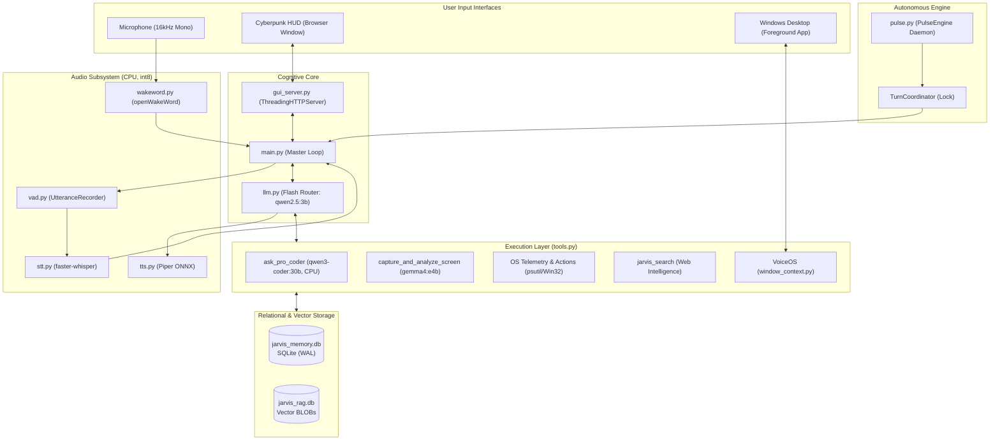

# ARCHITECTURE.md — System Interface Contracts & Technical Specs

> **MANDATORY REFERENCE FOR AGENTS:**  
> This document specifies the binding technical contracts, data models, IPC protocols, and threading rules for JARVIS.  
> Any agent modifying inter-module interfaces MUST ensure full compliance with these specifications.

---

## 1. System Topology & Information Flow



---

## 2. Model Tier Specifications & Invocation Contracts

All model invocations happen through `ollama.chat()` or `ollama.generate()` with strict parameter contracts:

### 2.1 Flash Tier (Cognitive Router)
- **Model:** `qwen2.5:3b`
- **Hardware Residency:** GPU VRAM (GTX 1660 4GB). Kept resident indefinitely.
- **Contract:**
  ```python
  ollama.chat(
      model="qwen2.5:3b",
      messages=messages,
      tools=available_tools,
      options={"num_gpu": -1, "temperature": 0.4},
      keep_alive=-1  # MUST remain -1
  )
  ```
- **Error Handling:** If Ollama returns a raw code block instead of a tool call when querying system state, `llm.py` MUST intercept it via `_strip_code_fences()` and re-prompt the model once.

### 2.2 Pro Coder Tier (Heavy Developer)
- **Model:** `qwen3-coder:30b`
- **Hardware Residency:** System RAM & CPU (Ryzen 2700X, 32GB RAM). On-demand only.
- **Contract (`tools.py:ask_pro_coder`):**
  ```python
  ollama.chat(
      model="qwen3-coder:30b",
      messages=[{"role": "user", "content": prompt}],
      options={"num_gpu": 0},  # MUST force 0 GPU layers
      keep_alive=0             # MUST unload immediately after response
  )
  ```

### 2.3 Vision Tier (Screen Inspector)
- **Model:** `gemma4:e4b`
- **Hardware Residency:** GPU VRAM / System RAM. On-demand only.
- **Contract (`tools.py:capture_and_analyze_screen`):**
  ```python
  ollama.chat(
      model="gemma4:e4b",
      messages=[{
          "role": "user",
          "content": prompt,
          "images": [base64_encoded_png]
      }],
      keep_alive=0  # MUST unload immediately
  )
  ```

---

## 3. Tool Registration & Dispatch Contract (`llm.py` <-> `tools.py`)

Every tool exposed to the assistant must adhere to this three-part contract:

1. **Implementation (`tools.py`):**
   - Must be fully typed with Python type hints.
   - Must return a human-readable `str` (or JSON-serialized string).
   - Must catch internal exceptions and return a descriptive error string (e.g. `f"Failed to [action]: {e}"`) rather than raising unhandled exceptions into the LLM loop.
   - Must NEVER execute blocking CLI `input()` when running in GUI mode.
2. **Schema Declaration (`llm.py:available_tools`):**
   - Must have a compliant Ollama tool JSON schema:
     ```python
     {
         "type": "function",
         "function": {
             "name": "tool_name",
             "description": "Clear explanation of when and why the model should call this tool.",
             "parameters": {
                 "type": "object",
                 "properties": {
                     "param1": {"type": "string", "description": "Parameter details"}
                 },
                 "required": ["param1"]
             }
         }
     }
     ```
3. **Dispatch Hook (`llm.py:_dispatch_tool`):**
   - Must map the function name string to the actual Python function call and pass arguments:
     ```python
     elif name == "tool_name":
         result = tools.tool_name(**args)
     ```
   - Must invoke the optional `tool_execution_callback(name, args, result)` for HUD telemetry.

---

## 4. VoiceOS Window Context & Dictation Contract (`window_context.py`)

### 4.1 Foreground Inspection Output Schema
The function `get_active_window_context()` must return a dictionary matching this schema:

```json
{
  "hwnd": 123456,
  "title": "Visual Studio Code - main.py",
  "process_name": "Code.exe",
  "app_name": "VS Code",
  "category": "coding"
}
```

### 4.2 Application Categories
The `category` field MUST be one of the following canonical strings:
- `"coding"` — IDEs, code editors, Git tools.
- `"chat"` — Messaging apps (Slack, Discord, Teams, WhatsApp).
- `"email"` — Email clients (Outlook, Thunderbird, Webmail).
- `"terminal"` — Consoles (PowerShell, Command Prompt, Windows Terminal, Bash).
- `"document"` — Office applications, word processors, notes (Word, Excel, Notion).
- `"browser"` — Web browsers in general navigation mode.
- `"general"` — Any unclassified application window.

---

## 5. Desktop HUD REST API Contracts (`gui_server.py`)

The local HTTP server runs on `http://127.0.0.1:8765`.

### 5.1 `GET /api/status`
Returns real-time telemetry polled by the frontend HUD every 1.5 seconds.

**Response Schema (200 OK):**
```json
{
  "state": "idle",
  "cpu": 14.2,
  "ram": 52.8,
  "vram": "1.9/4.0",
  "active_window": {
    "app_name": "VS Code",
    "category": "coding",
    "title": "main.py"
  },
  "last_tools": [
    {
      "name": "check_disk_space",
      "args": {"drive": "C:"},
      "result": "Total: 222.1 GB, Free: 9.7 GB",
      "timestamp": "22:30:15"
    }
  ]
}
```
*Note on `state`: Must be one of `"idle"`, `"listening"`, `"thinking"`, or `"speaking"`.*

### 5.2 `POST /api/chat`
Handles interactive text query input from the HUD interface.

**Request Schema:**
```json
{
  "message": "Check system stats and top consumers"
}
```

**Response Schema (200 OK):**
```json
{
  "response": "CPU is running at 14% and RAM is at 52%. System is stable, sir.",
  "tools_executed": [
    {"name": "get_system_stats", "args": {}, "result": "..."}
  ]
}
```

### 5.3 `POST /api/trigger_listen`
Triggers server-side microphone acquisition, Whisper STT, LLM reasoning, and TTS playback.

**Response Schema (200 OK):**
```json
{
  "transcription": "What time is the daily briefing scheduled for?",
  "response": "Your daily briefing is scheduled for 8:00 AM, sir."
}
```

---

## 6. Database Storage Schemas (`memory.py` & `rag.py`)

### 6.1 `jarvis_memory.db` (Relational Memory)
All tables operate under SQLite WAL mode (`PRAGMA journal_mode=WAL;`).

#### Table: `history`
```sql
CREATE TABLE IF NOT EXISTS history (
    id INTEGER PRIMARY KEY AUTOINCREMENT,
    role TEXT NOT NULL,           -- 'user' | 'assistant' | 'system'
    content TEXT NOT NULL,
    timestamp DATETIME DEFAULT CURRENT_TIMESTAMP
);
```

#### Table: `facts`
```sql
CREATE TABLE IF NOT EXISTS facts (
    id INTEGER PRIMARY KEY AUTOINCREMENT,
    fact TEXT NOT NULL,           -- Long-term persistent fact
    timestamp DATETIME DEFAULT CURRENT_TIMESTAMP
);
```

#### Table: `reminders`
```sql
CREATE TABLE IF NOT EXISTS reminders (
    id INTEGER PRIMARY KEY AUTOINCREMENT,
    text TEXT NOT NULL,           -- Reminder description
    due_timestamp TEXT NOT NULL,  -- ISO format string or parsable timestamp
    completed INTEGER DEFAULT 0,  -- 0 = pending, 1 = completed
    created_at DATETIME DEFAULT CURRENT_TIMESTAMP
);
```

### 6.2 `jarvis_rag.db` (Second Brain Knowledge Base)

#### Table: `documents`
```sql
CREATE TABLE IF NOT EXISTS documents (
    id INTEGER PRIMARY KEY AUTOINCREMENT,
    source TEXT NOT NULL          -- Absolute filesystem path
);
```

#### Table: `chunks`
```sql
CREATE TABLE IF NOT EXISTS chunks (
    id INTEGER PRIMARY KEY AUTOINCREMENT,
    doc_id INTEGER NOT NULL,
    text TEXT NOT NULL,
    embedding BLOB NOT NULL,      -- float32 numpy array serialized as raw bytes
    FOREIGN KEY(doc_id) REFERENCES documents(id)
);
```

---

## 7. Threading, Concurrency & Synchronization Rules

### 7.1 Turn Coordination (`pulse.py:TurnCoordinator`)
- A single global `TurnCoordinator` instance governs audio and speech turn arbitration.
- **Rule:** Before any background thread initiates audio output via `tts.speak()`, it MUST call:
  ```python
  if coordinator.acquire_pulse_turn(timeout_sec=30.0):
      try:
          tts.speak(announcement)
      finally:
          coordinator.end_user_interaction()
  ```
- When the user starts speaking or presses the PTT hotkey, `coordinator.start_user_interaction()` MUST be called immediately to freeze all background speech.

### 7.2 Database Locks Under Concurrency
To prevent `sqlite3.OperationalError: database is locked` across concurrent HTTP requests and background threads:
- Every SQLite connection MUST enable WAL mode and set a busy timeout of at least 5000 milliseconds:
  ```python
  conn = sqlite3.connect(DB_FILE, timeout=10.0)
  conn.execute("PRAGMA journal_mode=WAL;")
  conn.execute("PRAGMA busy_timeout=5000;")
  ```
